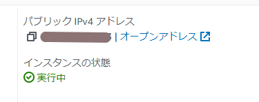

# AWSフルコース第4回課題 2022/10/01

- VPC、EC2、RDSの作成はテキストの通りに順調に進めた為、  
  Cloud9からEC2への接続、EC2からRDSへの接続に行った手順を成果物として提出致します。
- 別途自分用に用語も整理中ですがまだまだ作成途中で、今後理解が深まったら都度更新します。

## 課題作成した構成

### EC2

| タグ(Name) | VPCID | セキュリティグループ |
| --- | --- | --- |
| raisetech-ec2 | vpc-0************* | sg-0*************** (launch-wizard-1) |

- ※提出用は*で伏字にさせて頂きます。

### RDS

| DBクラスター識別子 | VPCID | セキュリティグループ |
| --- | --- | --- |
| database-1 | vpc-0*************** | default (sg-0***************) |

|  エンドポイント |
|  --- |
| database-1.***************.ap-northeast-1.rds.amazonaws.com |

- ※提出用は*で伏字にさせて頂きます。

---

## Cloud9からEC2へのログイン

1. EC2インスタンスのパブリックIPをコピーする。

    - インスタンス一覧からインスタンスIDをクリック
    - インスタンスの概要からパブリックIPアドレスを確認
    - ※パブリックIPアドレスはインスタンスを再起動するとその都度変わるので注意！

    

2. SSHコマンドでログイン試行する

    ```sh
    ssh -i ＜pemキーのパス＞ ec2-user@＜パブリックIP＞
    ```

    ※実行例

    ```sh
    ssh -i raisetech-sample.pem ec2-user@123.456.789.123
    ```

3. Permission deniedのエラー発生

    - 下図のエラーが発生する。

    

4. pemキーを~/.sshに移動し、パーミッションを700に変更

    ```sh
    mv /home/ec2-user/environment/raisetech-ec2.pem /home/ec2-user/.ssh
    chmod 700 raisetech-ec2.pem 
    ```

5. 再度SSHコマンドでログイン試行すると、ログイン成功する。

    

---

## EC2からRDSへのログイン

1. EC2からmysqlコマンドでRDSに接続する為、EC2側にmysqlをインストールする

    ```sh
    sudo yum install mysql
    ```

    - clientだけインストールで良いのではと思ったが今回は上記でインストールした<https://qiita.com/tamorieeeen/items/d9b2af588f1dfd43120d>

2. RDSのエンドポイントをコピーする

    

    - データベース一覧からデータベース識別子をクリック
    - 接続とセキュリティのエンドポイントを確認

3. 下記コマンドでRDSのMySQLにログインを試行する。

    ```sh
    mysql -u admin -p -h ＜RDSのエンドポイント＞
    ```

    ※実行例

    ```sh
    mysql -u admin -p -h database-1.***************.ap-northeast-1.rds.amazonaws.com -P 3306
    ```

4. MySQL接続エラー発生
    - 下図のエラーが発生する。

    

5. RDSのデータベース一覧からDB識別子をクリック
6. 接続とセキュリティのVPC セキュリティグループをクリック

    

7. インバウンドルールタブをクリック
8. 「インバウンドのルールを編集」ボタンをクリック
9. 「ルールを追加ボタン」をクリック
10. 以下の様にルールを追加する
    | タイプ | プロトコル | ポート | ソース |
    | --- | --- | --- | --- |
    | MySQL/Aurora | TCP(自動で入る) | 3306(自動で入る) | Ec2のセキュリティグループ |

    

11. 再度のMySQLにログインを試行すると成功する。

    

## 追記(EC2からRDS接続について)

- 後から分かった事ですが、RDS作成時にコンピューティングリソースの設定で「EC2コンピューティングリソースに接続」を選択すると、EC2からRDSに接続できるセキュリティグループ設定をよろしくやってくれました。。。  
  従ってこちらの選択肢を選んだ場合は、インバンドルールの手動設定は不要です。
  
    
