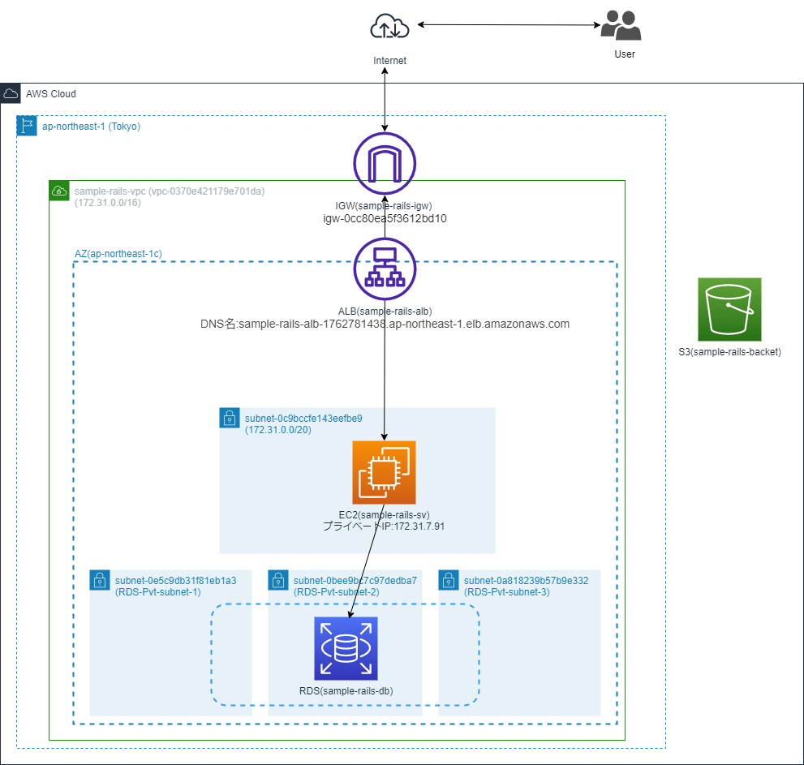
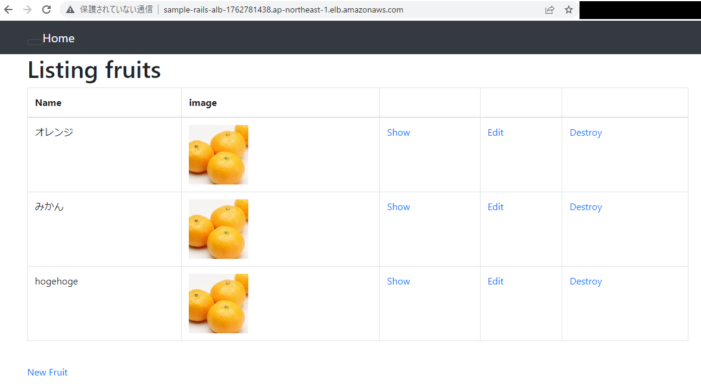
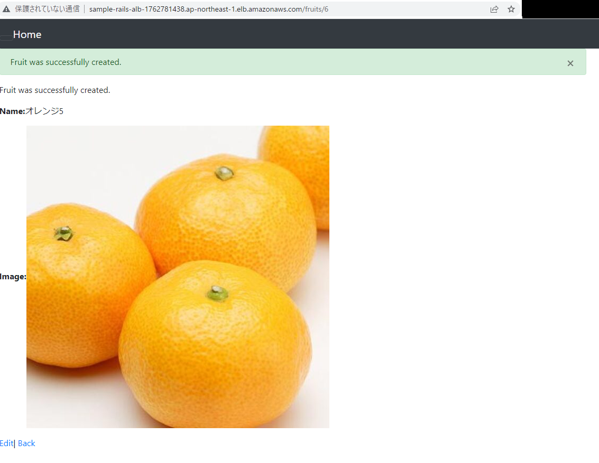
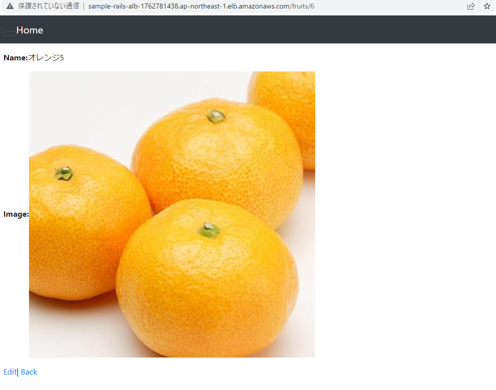
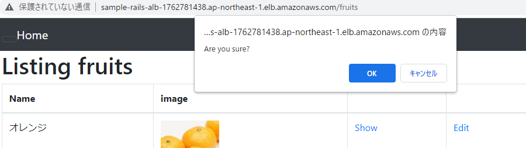
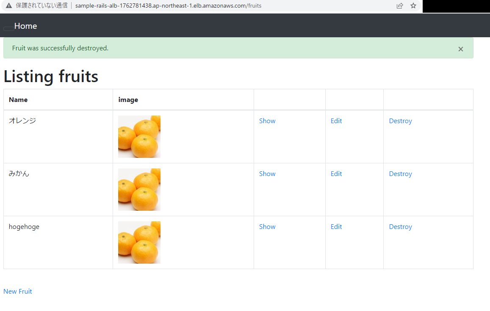

# 第5回課題 成果物

## 構成

| Service | Name | VPC ID |
| --- | --- | --- |
| VPC | sample-rails-vpc | vpc-0370e421179e701da |

| Service | Name | セキュリティグループ名 | セキュリティグループID |
| --- | --- | --- | --- |
| VPCセキュリティグループ | --- | rds-ed2-2 | sg-0159120bb928e1378 |

| Service | Name | リージョン | AZ| VPC ID | サブネット ID | セキュリティグループ |
| --- | --- | --- | --- | --- | --- | --- |
| EC2 | sample-rails-sv |  ap-northeast-1 |  ap-northeast-1c | vpc-0370e421179e701da | subnet-0c9bccfe143eefbe9 | sg-0475c78ca0fe3f2c0,  sg-044f229cf20c6eae0 |
| RDS | sample-rails-db | ap-northeast-1 | ap-northeast-1c | vpc-0370e421179e701da | subnet-0a818239b57b9e332,  subnet-0e5c9db31f81eb1a3,  subnet-0bee9bc7c97dedba7 | sg-0159120bb928e1378 |

| Service | Name | リージョン | AZ| VPC ID |
| --- | --- | --- | --- | --- |
| ELB(ALB) | sample-rails-alb | ap-northeast-1 |  ap-northeast-1a,1d,1c | vpc-0370e421179e701da |

| Service | Name | リージョン |
| --- | --- | --- |
| S3 | sample-rails-backet | ap-northeast-1 |

---

## 構成図

---

## エビデンス

- 一覧画面

    
- 追加画面

    
- 編集画面

    
- 削除モーダル

    
- 削除後メッセージ

    
