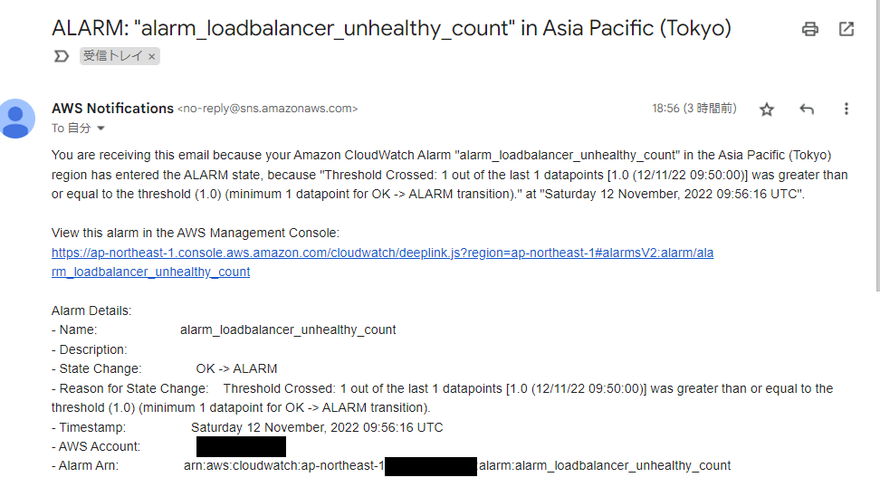
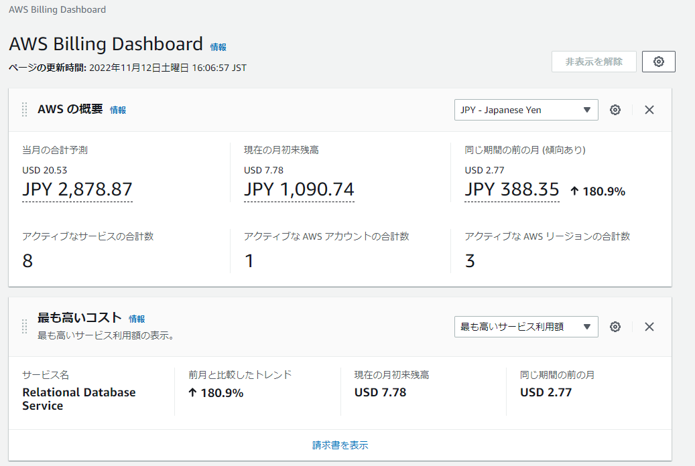

# AWSフルコース第5回課題

## CloudTrail課題

- 自身のIAMユーザー(hiro.iam.mgr)のイベントからEC2とRDSに関わるイベントを4件抽出しました。
- 項目はeventTime, eventSource, evnetNameの3つをピックアップしました。
- eventNameの説明は参考URLの内容を転載したのですが内容は十分に理解しておりません。。

| userIdentity/arn | eventTime | eventSource | eventName | 説明 |
| --- | --- | --- | --- | --- |
| arn:aws:iam::923122415383:user/hiro.iam.mgr | 2022-11-11T15:41:46Z | rds.amazonaws.com | DescribeOrderableDBInstanceOptions | 指定されたエンジンの注文可能な DB インスタンスオプションのリストを返すアクセス許可を付与 |
| arn:aws:iam::923122415383:user/hiro.iam.mgr | 2022-11-11T15:41:57Z | rds.amazonaws.com | DescribeDBInstances | プロビジョニングされた RDS インスタンスに関する情報を返すアクセス許可を付与 |
| arn:aws:iam::923122415383:user/hiro.iam.mgr | 2022-11-11T15:45:58Z | ec2.amazonaws.com | DescribeInstanceAttribute | インスタンスの属性を記述する許可を付与 |
| arn:aws:iam::923122415383:user/hiro.iam.mgr | 2022-11-11T15:45:58Z | ec2.amazonaws.com | DescribeInstanceCreditSpecifications | 1 つ以上のバーストパフォーマンスインスタンスの CPU 使用率のクレジットオプションを記述する許可を付与 |

- 参考：EC2のアクション説明 <https://docs.aws.amazon.com/ja_jp/service-authorization/latest/reference/list_amazonec2.html>

- 参考：RDSのアクション説明<https://docs.aws.amazon.com/ja_jp/service-authorization/latest/reference/list_amazonrds.html>

---

## CloudWatch課題

- Nginx + Unicorn稼働時  
  - Cloud Watch alarm  
    
  - アラームメール  
    

- Unicorn停止時
  - Cloud Watch alarm
    
  - アラームメール  
    

---

## 見積課題

- 見積ツールの結果
<https://calculator.aws/#/estimate?id=6349db805f12ab38a92753b170cb7df95450da54>

---

## 利用料金課題

いつのまにかRDSが無料枠を大幅に超えてしまった様です。。。RDSを作成する時に選択を間違えたかもしれません。
この課題提出後に作り直してみます。

- Billing

    

- Cost Explorer

    

- Dashborad

    
